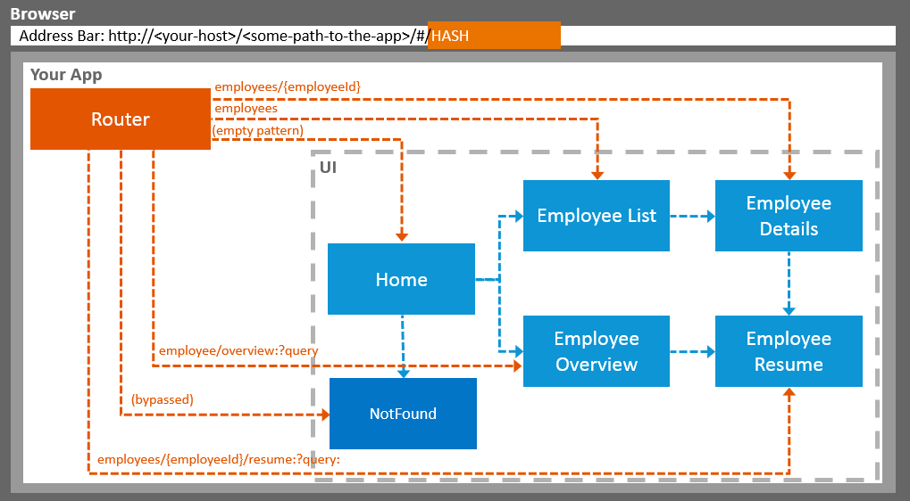

# UI5-Navigation-and-Routing

This repository is meant to serve as example for how navigation and routing works within UI5. It is basically what happens when you work through the entire "Navigation and Routing"-Section within the official [UI5 documentation](https://sapui5.hana.ondemand.com/#/topic/1b6dcd39a6a74f528b27ddb22f15af0d).

### The complete flow of the application as it can also be seen on the [Documentation](https://sapui5.hana.ondemand.com/#/topic/1b6dcd39a6a74f528b27ddb22f15af0d).

You basically read it like this - starting from the home page (here simply called 'Home') you can do the following:

* Display a _Not Found_ page
* Navigate to a list of employees and drill further down to see a _Details_ page for each employee
* Show an _Employee Overview_ that they can search and sort



# Getting Started
You can just clone this repository, run npm install and use the [UI5 tooling](https://github.com/SAP/ui5-tooling) to locally serve the application in order to debug/learn from it.

Hint: it already uses the livereload-middleware for the [UI5 tooling](https://github.com/SAP/ui5-tooling), so changes while serving will trigger an immediate update in the browser.

1. Clone the repository
    ```sh
    git clone <repository-url>
    ```
1. Navigate into the cloned repository 
    ```sh
    cd <repository>
    ```
1. Install all dependencies
    ```sh
    npm install
    ```
1. Start the application
    ```sh
    npm start
    ```
## Namespace & Projectname

The paths within this project are - as usual - prefixed by the `projectId` ( which is declared within the `manifest.json` file). The prefix is made up by a given namespace and the name of the project. I must admit that the project name is quite verbose.

* Namespace: `com.mrb`
* Projectname: `UI5-Navigation-and-Routing`


# Tutorial Steps

* Step 1: Set Up the Initial App :white_check_mark:
* Step 2: Enable Routing :white_check_mark: [d794190](https://github.com/SAPMarco/UI5-navigation-and-routing/commit/d794190d86fa3d75debb52da22d9b8b875ff65f1)
* Step 3: Catch Invalid Hashes :white_check_mark: [1c39c78](https://github.com/SAPMarco/UI5-navigation-and-routing/commit/1c39c783ad765a141e05e62eaac1a428c4048811)
* Step 4: Add a Back Button to Not Found Page :white_check_mark: [1c39c78](https://github.com/SAPMarco/UI5-navigation-and-routing/commit/1c39c783ad765a141e05e62eaac1a428c4048811)
* Step 5: Display a Target Without Changing the Hash :white_check_mark: [574db78](https://github.com/SAPMarco/UI5-navigation-and-routing/commit/574db78c3f2210b479f21e41b6852da455c4e232)
* Step 6: Navigate to Routes with Hard-Coded Patterns :white_check_mark: [61af8c1](https://github.com/SAPMarco/UI5-navigation-and-routing/commit/61af8c1732bf74596d5734dde805079aba068954)
* Step 7: Navigate to Routes with Mandatory Parameters :white_check_mark: [f99257a](https://github.com/SAPMarco/UI5-navigation-and-routing/commit/f99257a0554b31470d75c0aa331b4f61154acc4b)
* Step 8: Navigate with Flip Transition :white_check_mark: [fdea453](https://github.com/SAPMarco/UI5-navigation-and-routing/commit/fdea4537be8cc4fc146786c14c0f2e532184d1f0)
* Step 9: Allow Bookmarkable Tabs with Optional Query Parameters :white_check_mark: [66a8048](https://github.com/SAPMarco/UI5-navigation-and-routing/commit/66a8048db3790aafb779202dd82fd7c9d1a312ce)
* Step 10: Implement "Lazy Loading" :white_check_mark: [8d6ecce](https://github.com/SAPMarco/UI5-navigation-and-routing/commit/8d6eccea5146c4eeb7b79d092b5776db784e5608)
* Step 11: Assign Multiple Targets :white_check_mark: [6795425](https://github.com/SAPMarco/UI5-navigation-and-routing/commit/67954255fa08fc8d361a7c6302b40471ae1df2c6)
* Step 12: Make a Search Bookmarkable :white_check_mark: [a06ed69](https://github.com/SAPMarco/UI5-navigation-and-routing/commit/a06ed69d4df852ac1b16d2944f846be48188a982)
* Step 13: Make Table Sorting Bookmarkable :white_check_mark: [4cfa12f](https://github.com/SAPMarco/UI5-navigation-and-routing/commit/4cfa12f50b93c4601c0ecb02e4bb37d1e2fad2ab)
* Step 14: Make Dialogs Bookmarkable :white_check_mark: [6927b79](https://github.com/SAPMarco/UI5-navigation-and-routing/commit/6927b7938c44e94166f723ae514970e16808b755)
* Step 15: Reuse an Existing Route :white_check_mark: [d747ffe](https://github.com/SAPMarco/UI5-navigation-and-routing/commit/d747ffee73852a4bbde490ca89e9bec3649b3e48)
* Step 16: Handle Invalid Hashes by Listening to Bypassed Events :white_check_mark: [08791dc](https://github.com/SAPMarco/UI5-navigation-and-routing/commit/08791dcfbbf01b9d0f059fa941bb9060d9edb4f6)
* Step 17: Listen to Matched Events of Any Route :white_check_mark: [9298a5d](https://github.com/SAPMarco/UI5-navigation-and-routing/commit/9298a5d451a8ae5ea83c207c041c28bc513dcfeb)

Implemented = :white_check_mark:

# Credits

For more information check:

* [Wiki entry](https://github.com/SAPMarco/SAPMarco.github.io/wiki/UI5-Basics-of-Routing) for basics of routing or 
* [UI5 documentation](https://sapui5.hana.ondemand.com/#/topic/1b6dcd39a6a74f528b27ddb22f15af0d)
* [UI5ers Buzz #46 - routing with nested components](https://blogs.sap.com/2020/02/05/ui5er-buzz-46-routing-with-nested-components/)
* [UI5ers Buzz #48 - title changes of nested components](https://blogs.sap.com/2020/03/23/ui5ers-buzz-48-consuming-title-changes-of-nested-components/)